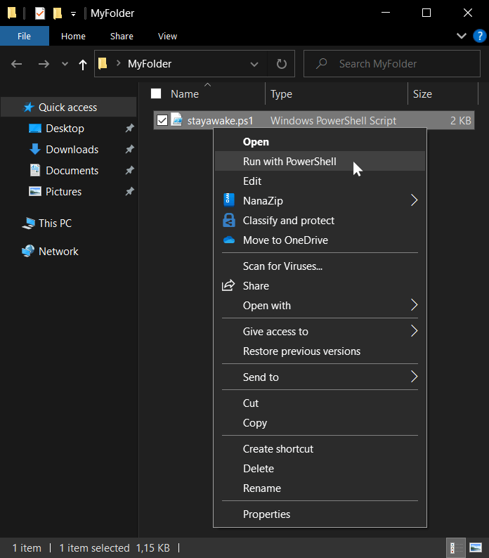

# StayAwake
This script keeps your computer from sleeping and keeps you active on apps like Microsoft Teams. It does so by pressing the F13 key every 6 seconds for a certain time. The F13 key doesn't exist physically but virtually, so most of the programs on your computer shouldn't react to it.

This script does not require any installation or admin rights. Also, it just runs on Windows machines.

To use it, simply download "stayawake.ps1". Then right click and select "Run with PowerShell".

> **Warning**\
> Especially in a work environment, it makes sense for a computer to lock itself after a certain time. This script bypasses this security feature. Be aware that people with physical access could harm your company or your private network.
